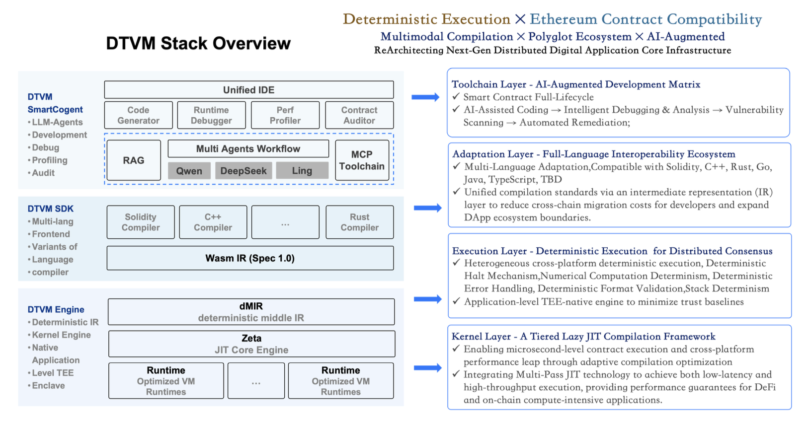
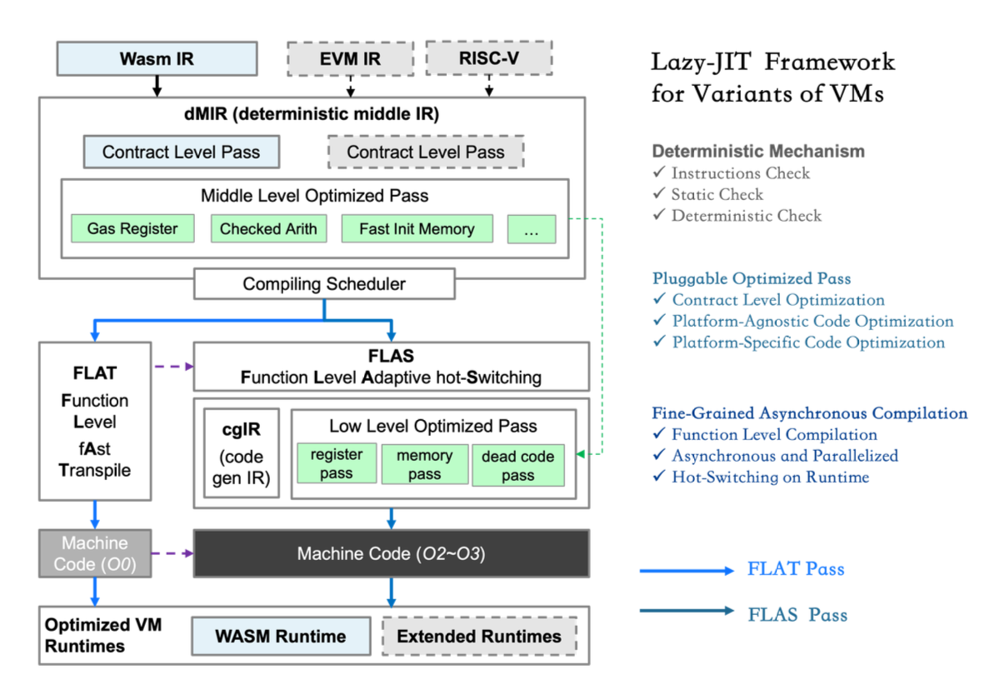

DTVM
===============

DTVM (DeTerministic Virtual Machine) is a next-generation blockchain virtual machine that addresses critical performance, determinism, and ecosystem compatibility challenges in blockchain networks. Building upon WebAssembly (Wasm) while maintaining full Ethereum Virtual Machine (EVM) ABI compatibility, DTVM introduces:

1. **Deterministic Middle Intermediate Representation (dMIR)**
   - Blockchain-specific intermediate representation for cross-platform deterministic execution
   - Modular adaptation layers translating diverse instruction sets (now Wasm, EVM and RISC-V in the future) into unified dMIR
   - Hybrid lazy-JIT compilation engine with dynamic optimization levels (O0~O2)
   - Trampoline hot-switch mechanism for sub-millisecond post-deployment invocation

2. **Multi-Language Smart Contract Development**
   - Support for multiple programming languages (Solidity, C++, etc.)
   - Cross-language contract interaction capabilities
   - Ethereum ABI compatibility for seamless integration with existing Ethereum ecosystem
   - Web3 SDK support for contract deployment and interaction

2. **ZetaEngine: High-Performance WASM Runtime**
   - Deterministic execution (dWasm) with strict security constraints
   - Multiple execution modes: interpreter, singlepass JIT, and multipass JIT
   - Optimized for blockchain smart contract environments
   - Cross-platform deterministic execution runtime

4. **SmartCogent: AI-Driven Development Tools**
   - Integrated code generation, security auditing, and repair workflows
   - 80%+ vulnerability detection accuracy and 85%+ automated repair success rates
   - Retrieval-augmented generation for smart contract lifecycle automation
   - Enhanced development productivity and security





ZetaEngine stands as the core WebAssembly (WASM) runtime project within the DTVM ecosystem, licensed under the Apache License (Version 2.0) with LLVM exceptions.

This powerful engine is designed to bring high-performance and efficient execution environment for WebAssembly applications.

As a WebAssembly (WASM) runtime project, this powerful engine is specifically tailored for blockchain smart contract environments, providing a high-performance, secure, and cross-platform deterministic execution runtime. It offers a comprehensive suite of blockchain-specific design features, addressing the unique challenges of distributed computing and smart contract execution. The engine delivers exceptional performance, robust security mechanisms, and guaranteed cross-platform consistency critical for blockchain and decentralized application (dApp) ecosystems.

This product incorporates various third-party components, each under their respective open source licenses. For a comprehensive list of these components and the associated license information, please refer to the `NOTICE` file.

# Introduction
Currently, the virtual machine supports `interpreter` mode, `singlepass` mode, and `multipass` mode, with `interpreter` mode being the default execution mode.

ZetaEngine offers C++, C, and Rust APIs for use as a library, or as a command-line tool for WASM execution. And you can use it in SGX enclaves.

<a name="teEUv"></a>
## Build
<a name="fj3o5"></a>
### Interpreter

Build commands:

```cpp
cmake -B build -DCMAKE_BUILD_TYPE=Debug
cmake --build build
```

For more CMake options, consult: [docs/user-guide.md](docs/user-guide.md)

<a name="p1COz"></a>
### singlepass JIT

Build commands:

```cpp
cmake -B build -DCMAKE_BUILD_TYPE=Debug -DZEN_ENABLE_SINGLEPASS_JIT=ON
cmake --build build
```
For more CMake options, consult:[docs/user-guide.md](docs/user-guide.md)
<a name="keF6Z"></a>
### multipass JIT
`multipass JIT` mode relies on `LLVM` 15. You can install llvm-15 by download pre-built llvm 15 from github.

If you use MacOS X, install it by `brew install llvm@15` and then the llvm 15 installed at `/usr/local/opt/llvm@15`.

Then, build ZetaEngine with `multipass JIT` mode:

```cpp
cmake -B build -DCMAKE_BUILD_TYPE=Debug -DZEN_ENABLE_MULTIPASS_JIT=ON -DLLVM_DIR=<llvm-path>/lib/cmake/llvm -DLLVM_SYS_150_PREFIX=<llvm-path>
cmake --build build
```

Consult: [docs/user-guide.md](docs/user-guide.md) for other CMake options.

Note: multipass JIT currently only supports the x86-64 target.

## Use as a C/C++ library

You can include the `src/zetaengine.h` or `src/zetaengine-c.h` in you projects, and link the built `libzetaengine.a` to use ZetaEngine in your C/C++ project.

Refer to the `example/c_api/main.c` file for an example of how to incorporate ZetaEngine into a C project.

## Use as a Rust library

Refer to [rust_crate/README.md](rust_crate/README.md) for more details.

## DTVM Contract SDKs

DTVM provides official SDKs for developing smart contracts in different programming languages:

### C++ Contract SDK
The [DTVM C++ SDK](https://github.com/DTVMStack/DTVM_CppSDK) provides a comprehensive set of tools and libraries for developing smart contracts in C++. It includes:
- Standard contract templates and examples
- Development tools and utilities
- Testing framework
- Documentation and guides

### Solidity Contract SDK
The [DTVM Solidity SDK](https://github.com/DTVMStack/DTVM_SolSDK) enables developers to write smart contracts in Solidity while maintaining compatibility with the DTVM ecosystem. It features:
- Ethereum ABI compatibility
- Standard contract interfaces
- Development tools and utilities
- Testing framework
- Documentation and guides

<a name="p8TeO"></a>
## Command-Line Execution
Execute a `wasm` file using `dtvm` as follows:
```cpp
dtvm -f add i32.wasm --fargs "2 3"

dtvm i32.wasm --repl
webassembly>add 1 1
0x2:i32

dtvm --dir . -f add i32.wasm --fargs "3 1"
0x4:i32

dtvm --mode 0 i32.wasm  // interpreter mode

dtvm --mode 1 i32.wasm  // singlepass mode

dtvm --mode 2 i32.wasm  // multipass mode

```
Refer to [docs/user-guide.md](docs/user-guide.md) for command-line arguments.

## Contributing

We welcome contributions to DTVM! Before contributing, please read our [Contributing Guidelines](CONTRIBUTING.md). 

<a name="Ry0Ak"></a>
## Test
<a name="dHXF2"></a>
### Specification Tests （UT）
Enable `ZEN_ENABLE_SPEC_TEST` during compilation.

<a name="kjNq3"></a>
#### Execute All Cases

```cpp
cd build
ctest --verbose

or

./build/specUnitTests 0  // interpreter mode
    
./build/specUnitTests 1  // singlepass mode
    
./build/specUnitTests 2  // multipass mode
```
<a name="GDqeE"></a>
#### Execute a Single Case
When testing a single case, specify the case name (without the `.wast` suffix):

```cpp
./build/specUnitTests i32 0  // interpreter mode

./build/specUnitTests i32 1  // singlepass mode

./build/specUnitTests i32 2  // multipass mode
```
<a name="LZOpW"></a>
#### Custom wast Case Testing
For custom `wast` tests, create a new directory under `tests/spec` and place your test there. For example, <br /> if the relative path is `tests/spec/mytest/demo.wast`, run:

```cpp
./build/specUnitTests mytest/demo <0/1/2>
```
