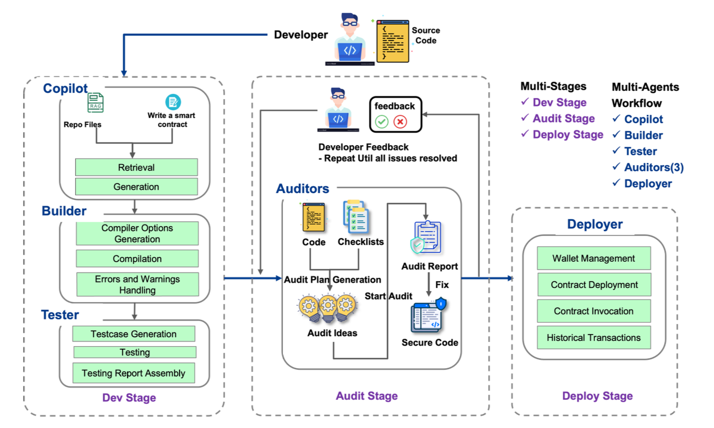

DTVM
===============

DTVM (DeTerministic Virtual Machine) is a next-generation blockchain virtual machine that addresses critical performance, determinism, and ecosystem compatibility challenges in blockchain networks. Building upon WebAssembly (Wasm) while maintaining full Ethereum Virtual Machine (EVM) ABI compatibility.

[Read the DTVM Technical Paper](./resources/DTVM_paper.pdf)


DTVM introduces:

1. **Deterministic JIT Execution Engine with Enhanced Performance**
   * Implements a blockchain-specific Deterministic Middle Intermediate Representation (dMIR) that ensures deterministic execution guarantees
   * Provides modular adaptation layers translating diverse instruction sets (Wasm, EVM, and RISC-V in the future) into unified dMIR
   * Features a hybrid lazy-JIT compilation engine with dynamic optimization levels (O0~O2), optimizing both compilation efficiency and execution speed

2. **EVM ABI Compatibility and Multi-Language Ecosystem Support**
   * Maintains compatibility with the latest Solidity 0.8.x specification while supporting six frontend programming languages (Solidity, C/C++, Rust, Java, Golang, and AssemblyScript)
   * Enables cross-language contract interaction capabilities
   * Offers Ethereum ABI compatibility for seamless integration with existing Ethereum ecosystem
   * Provides Web3 SDK support for contract deployment and interaction

3. **TEE-Native Security and Hardware-Optimized Efficiency**
   * Delivers high portability for application-level TEEs such as Intel SGX through a minimized Trusted Computing Base (TCB)
   * Features small codebase and binary library size compared to competitive Wasm implementations, minimizing potential attack surfaces while maintaining security and efficiency
   * Utilizes modern processor registers and exception handling mechanisms to address specialized requirements such as gas metering and boundary checks in JIT compilation

4. **[SmartCogent](https://docs.zan.top/docs/quickstart-guide-smartcogent): AI-Powered Smart Contract Development and Auditing**
   * Integrates code generation, security auditing, and repair workflows
   * Achieves 80%+ vulnerability detection accuracy and 85%+ automated repair success rates
   * Implements retrieval-augmented generation for smart contract lifecycle automation
   * Enhances development productivity and security



The DTVM Engine introduces a Lazy-JIT compilation framework(code name is **ZetaEngine**) with Wasm runtime environment.

**ZetaEngine** is specifically tailored for blockchain smart contract environments, providing a high-performance, secure, and cross-platform deterministic execution runtime. It offers a comprehensive suite of blockchain-specific design features, addressing the unique challenges of distributed computing and smart contract execution. The engine delivers exceptional performance, robust security mechanisms, and guaranteed cross-platform consistency critical for blockchain and decentralized application (dApp) ecosystems.


# Introduction

ZetaEngine currently supports three execution modes: `lazy-jit` mode (also known as `multipass`, which includes `FLAT` and `FLAS` modes), `singlepass` mode, and `interpreter` mode.

**FLAT Mode** : Function Level fAst Transpile mode

**FLAS Mode**: Function Level Adaptive hot-Switching mode

ZetaEngine provides comprehensive programming interfaces in C++, C, and Rust, enabling seamless integration as both a library and a command-line tool for Wasm execution. 
Additionally, it offers native support for Intel SGX enclaves, ensuring secure execution in trusted environments.

<a name="teEUv"></a>
## Build
<a name="fj3o5"></a>

### Lazy JIT

The Lazy-JIT compilation framework (ZetaEngine) incorporates two execution modes: FLAT mode for rapid execution and FLAS mode for optimized performance. These modes can seamlessly switch between each other when Lazy-JIT is enabled.

`Lazy JIT` relies on `LLVM` 15 for code generation. You can install llvm-15 by download pre-built llvm 15 from github.

Then, build ZetaEngine with `Lazy JIT` (multipass JIT) mode:

```cpp
cmake -B build -DCMAKE_BUILD_TYPE=Debug -DZEN_ENABLE_MULTIPASS_JIT=ON -DLLVM_DIR=<llvm-path>/lib/cmake/llvm -DLLVM_SYS_150_PREFIX=<llvm-path>
cmake --build build
```

Consult: [docs/user-guide.md](docs/user-guide.md) for other CMake options.

Note: Lazy JIT currently only supports the x86-64 target.

### Other Modes

DTVM also provides a standalone singlepass JIT and an interpreter by default. User can try this simple version via below instructions

***Singlepass JIT***

Singlepass JIT mode offers a lightweight alternative that doesn't require LLVM installation. It provides cross-platform compatibility, supporting both x86 and ARM64 architectures for flexible deployment options.

Build commands:

```cpp
cmake -B build -DCMAKE_BUILD_TYPE=Debug -DZEN_ENABLE_SINGLEPASS_JIT=ON
cmake --build build
```
For more CMake options, consult:[docs/user-guide.md](docs/user-guide.md)
<a name="keF6Z"></a>

***Interpreter***

Build commands:

```cpp
cmake -B build -DCMAKE_BUILD_TYPE=Debug
cmake --build build
```

For more CMake options, consult: [docs/user-guide.md](docs/user-guide.md)

<a name="p1COz"></a>

## Use as a C/C++ library

You can include the `src/zetaengine.h` or `src/zetaengine-c.h` in you projects, and link the built `libzetaengine.a` to use ZetaEngine in your C/C++ project.

Refer to the `example/c_api/main.c` file for an example of how to incorporate ZetaEngine into a C project.

## Use as a Rust library

Refer to [rust_crate/README.md](rust_crate/README.md) for more details.

## DTVM Contract SDKs

DTVM provides official SDKs for developing smart contracts in different programming languages:

### C++ Contract SDK
The [DTVM C++ SDK](https://github.com/DTVMStack/DTVM_CppSDK) provides a comprehensive set of tools and libraries for developing smart contracts in C++. It includes:
- Standard contract templates and examples
- Development tools and utilities
- Testing framework
- Documentation and guides

### Solidity Contract SDK
The [DTVM Solidity SDK](https://github.com/DTVMStack/DTVM_SolSDK) enables developers to write smart contracts in Solidity while maintaining compatibility with the DTVM ecosystem. It features:
- Ethereum ABI compatibility
- Standard contract interfaces
- Development tools and utilities
- Testing framework
- Documentation and guides

<a name="p8TeO"></a>
## Command-Line Execution
Execute a `wasm` file using `dtvm` as follows:
```cpp
dtvm -f add i32.wasm --fargs "2 3"

dtvm i32.wasm --repl
webassembly>add 1 1
0x2:i32

dtvm --dir . -f add i32.wasm --fargs "3 1"
0x4:i32

dtvm --mode interpreter i32.wasm

dtvm --mode singlepass i32.wasm

dtvm --mode multipass i32.wasm

```
Refer to [docs/user-guide.md](docs/user-guide.md) for command-line arguments.

## Contributing

We welcome contributions to DTVM! Before contributing, please read our [Contributing Guidelines](CONTRIBUTING.md). 

<a name="Ry0Ak"></a>
## Test
<a name="dHXF2"></a>
### Specification Tests （UT）
Enable `ZEN_ENABLE_SPEC_TEST` during compilation.

<a name="kjNq3"></a>
#### Execute All Cases

```cpp
cd build
ctest --verbose

or

./build/specUnitTests 0  // interpreter mode
    
./build/specUnitTests 1  // singlepass mode
    
./build/specUnitTests 2  // multipass mode
```
<a name="GDqeE"></a>
#### Execute a Single Case
When testing a single case, specify the case name (without the `.wast` suffix):

```cpp
./build/specUnitTests i32 0  // interpreter mode

./build/specUnitTests i32 1  // singlepass mode

./build/specUnitTests i32 2  // multipass mode
```
<a name="LZOpW"></a>
#### Custom wast Case Testing
For custom `wast` tests, create a new directory under `tests/spec` and place your test there. For example, <br /> if the relative path is `tests/spec/mytest/demo.wast`, run:

```cpp
./build/specUnitTests mytest/demo <0/1/2>
```

***Notice***

This project incorporates various third-party components, each under their respective open source licenses. For a comprehensive list of these components and the associated license information, please refer to the `NOTICE` file.
